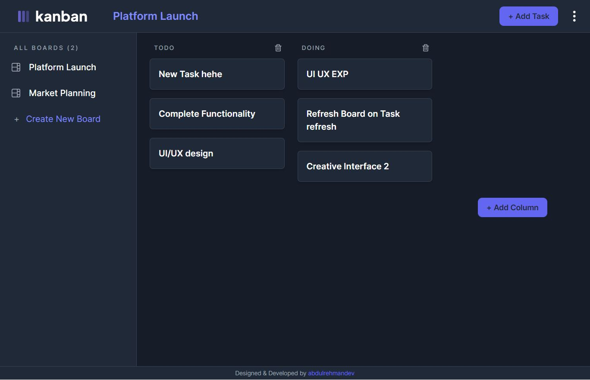

# Kanban Task Manager

Kanban task manager allows users to create, edit, and delete tasks. Users can create different boards, and each board can have any number of columns. Tasks can have subtasks as well. The app is responsive and supports both light and dark themes.

<p align="center">
    
</p>

### Technologies Used
* React
* Next.js
* Tailwind
* Firebase
* NextAuth

### Features
* Create, edit, and delete tasks
* Create different boards
* Each board can have any number of columns
* Responsive and supports both light and dark themes
* Authentication with NextAuth
* Deployed on Vercel

## Getting Started

Clone the repository using
```bash
git clone https://github.com/abdulrehmandev/kanban-task-manager.git 
```

Install the dependencies
```bash
npm install
# or 
yarn install
# or
pnpm install
```
Run the development server
```bash
npm run dev
# or
yarn dev
# or
pnpm dev
```

Open [http://localhost:3000](http://localhost:3000) with your browser to see the result.

## To Do
* Add more features
* Add subtasks
* Drag tasks between different columns
* Improve the UI
* Add unit tests
* Add e2e tests

## Contact
If you have any questions or feedback, please feel free to contact me at [beingabdulr@gmail.com](mailto:beingabdulr@gmail.com).

### Deployed on Vercel

The Kanban Task Manager is deployed on Vercel. You can visit the website [here](https://task-manager-abdulrdev.vercel.app/).
